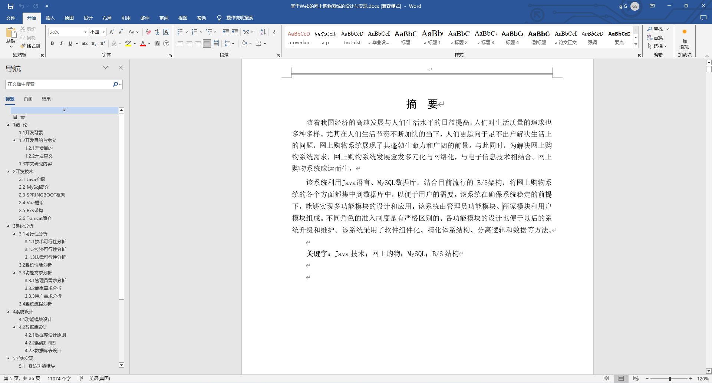
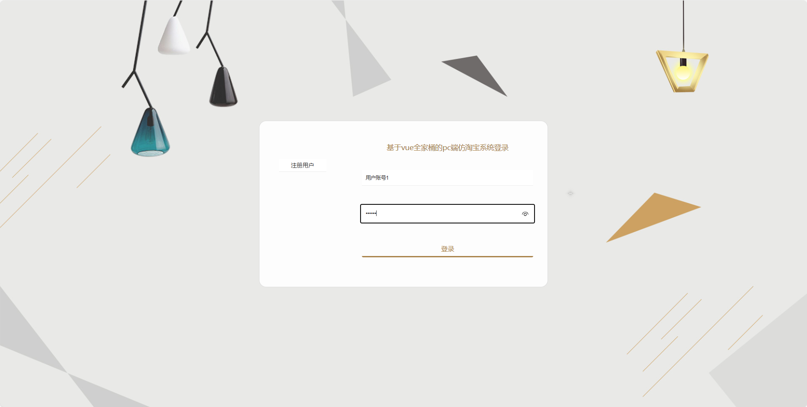
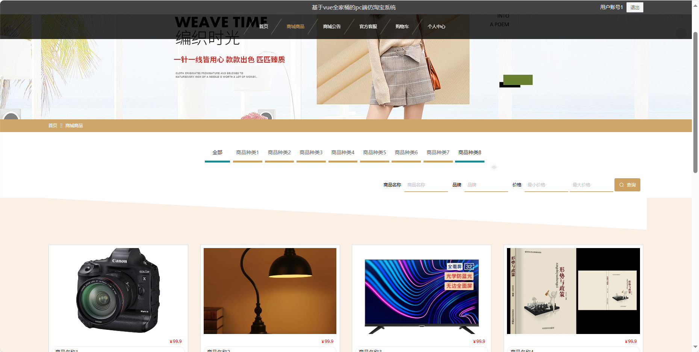
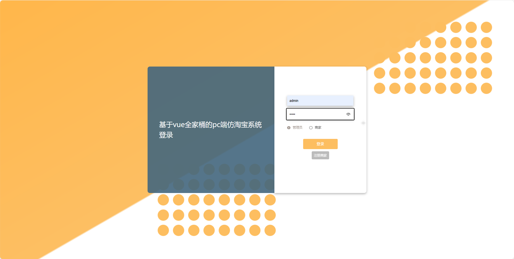

基于Springboot的pc端仿淘宝系统（程序+论文）
=
### 完整代码获取地址：从戎源码网 ([https://armycodes.com/](https://armycodes.com/))
### 作者微信：19941326836  QQ：952045282 
### 承接计算机毕业设计、Java毕业设计、Python毕业设计、深度学习、机器学习
### 选题+开题报告+任务书+程序定制+安装调试+论文+答辩ppt 一条龙服务
### 所有选题地址https://github.com/nature924/allProject

一、项目介绍
---
基于Spring Boot框架实现的pc端仿淘宝系统，系统包含三种角色：管理员、用户,商家主要功能如下。
### 【用户功能】

首页：浏览系统的主要信息。
商城商品：查看商城中的各类商品，包括商品详情和价格。
商城公告：阅读系统发布的相关公告和通知。
官方客服：与系统提供的官方客服进行在线沟通。
购物车：管理已选购商品，包括添加、删除和结算功能。
个人中心：管理个人信息、查看订单记录等。

### 【管理员功能】

系统首页：查看系统整体概况。
个人中心：管理个人信息。
商家管理：审核和管理注册商家的基本信息。
用户管理：管理系统注册用户的信息。
商品种类管理：管理商城中的商品分类信息。
商城商品管理：监管和管理商城中的商品信息。
系统管理：管理系统的基本设置和运行参数。
订单管理：查看和处理用户的购物订单。

### 【商家功能】

系统首页：查看商家相关的概况。
个人中心：管理个人商家信息。
商家管理：编辑和管理商家基本信息。
商城商品管理：管理商家发布的商品信息。
订单管理：查看和处理用户购买商家商品的订单。

二、项目技术
---
- 编程语言：Java
- 数据库：MySQL
- 项目管理工具：Maven
- 前端技术：VUE、HTML、Jquery、Bootstrap
- 后端技术：Spring、SpringMVC、MyBatis

三、运行环境
---
- 操作系统：Windows、macOS都可以
- JDK版本：JDK1.8以上都可以
- 开发工具：IDEA、Ecplise、Myecplise都可以
- 数据库: MySQL5.7以上都可以
- Tomcat：任意版本都可以
- Maven：任意版本都可以

四、运行截图
---
### 论文截图：

### 程序截图：

